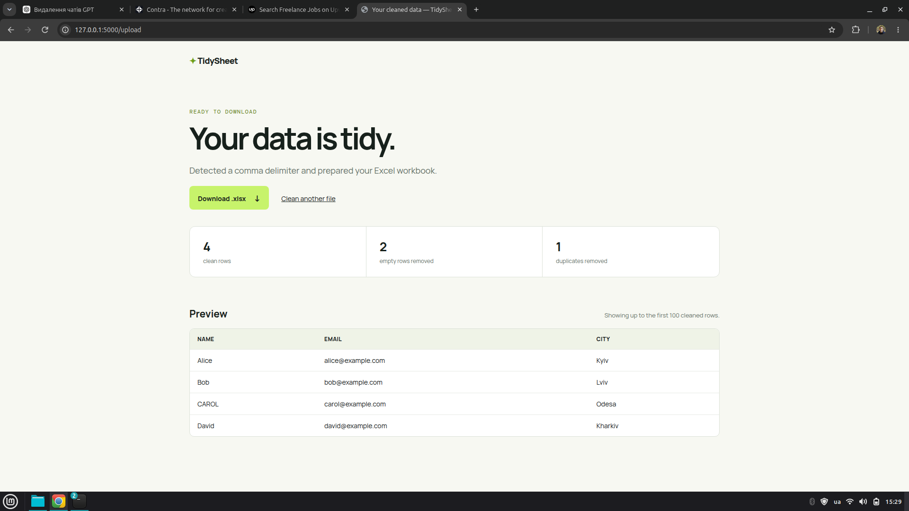

# TidySheet

A small Flask app that turns a messy CSV into a clean Excel workbook. It detects comma, semicolon, and tab delimiters; trims cells; removes fully empty and duplicate rows; and preserves the original column names and order.



Uploaded CSVs are saved under `uploads/` with a unique name and are never overwritten. Generated workbooks are saved separately in `exports/`.

## Setup

```bash
cd /home/roman/Projects/csv-web-app
python3 -m venv .venv
source .venv/bin/activate
pip install -r requirements.txt
```

## Run the app

```bash
cd /home/roman/Projects/csv-web-app
source .venv/bin/activate
flask --app app run --debug
```

Open `http://127.0.0.1:5000` in your browser.

## Run tests

```bash
cd /home/roman/Projects/csv-web-app
source .venv/bin/activate
pytest
```

## Project layout

```text
app.py             Flask application and routes
processor.py       CSV parsing, cleaning, and Excel export
templates/         HTML pages
static/            Responsive stylesheet
tests/             Processing and route tests
uploads/           Uploaded sources (ignored by Git)
exports/           Generated workbooks (ignored by Git)
```

## Notes

- Only UTF-8 CSV files up to 10 MB are accepted.
- A header row is required; files with inconsistent column counts receive a clear error.
- The browser preview shows the first 100 cleaned rows; the download contains every cleaned row.
